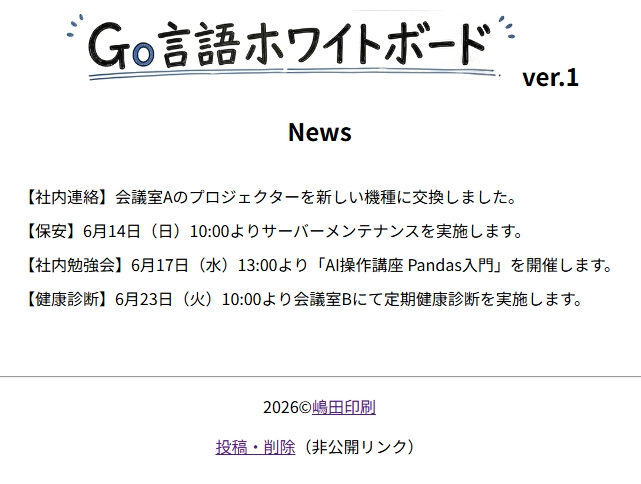

# 

Go言語だけで作られた軽量な社内連絡・お知らせシステムです。

データベース不要で動作し、Windows・Linux・Macに対応しています。

## 使用方法
* header.png、posts.txt、(os名)_main.exeをダウンロードし、
  win_main.exe（Windows版アプリ本体）をダブルクリックで起動
* 著作権表記の変更などは、下記の有料記事内のソースコード
  main.goで可能
* main.goを各OSでビルドすれば使用可能。win_main.exeでも
  仮想ソフトWineなどを使用で、Linuxなどで使用可能

## 特徴

* Go標準ライブラリのみ使用
* データベース不要
* 投稿機能
* 削除機能
* ログイン機能
* Cookie認証
* スマホ対応
* LAN運用対応
* 中古PCでも運用可能

## 詳細説明

著作権表記などを御社向けに変更や、記事の投稿・削除画面の閲覧は、  
以下の有料記事を購入後に出来ます。

[紙掲示板を置き換えるGo言語製ホワイトボードWebサーバー｜スマホ対応・低コスト社内連絡システム
](https://note.com/shimada_print/n/n04afd1c02542)
